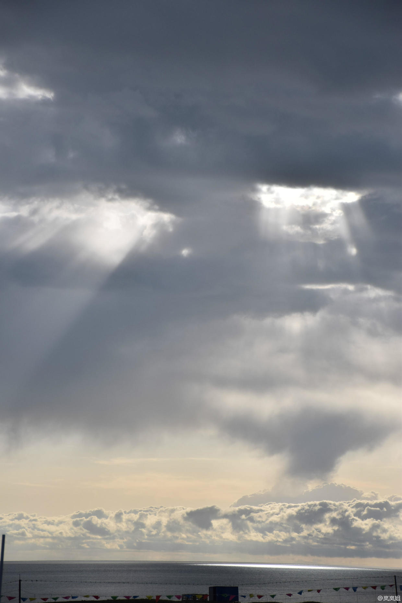

本打算和朋友两人在青海湖骑行加露营的，但是我俩都是头一回骑行，没有这方面的经验，加上之前一个朋友灌输了很多青海当地人在旅游开发过程中向“钱”看的事迹，我很担心这样冒失地去玩会遇到什么意外。后来朋友在网上找到一个骑行团队，它有保障车，提供骑行过程中必要的水、药物等，规划好了每天的行程和住宿，我俩也不用做什么攻略，索性就报了6月27日到7月1日的骑行活动。
在从西宁出发去西海镇的路上，天南地北的朋友聚在一起，从大连到海南，从8岁到65岁，每个人都有自己来青海湖的原因：经常骑行的夫妻想来过个瘾；刚买车不久来挑战自己；请年假参加同学婚礼，发现还有剩余时间，就来完成读了四年大学一直想做的事；计划了三年，终于决定来圆梦；为了满足孩子去鸟岛的愿望，一家三口一起来骑行；毕业同学约定了一起来，最后就自己一个人被忽悠来了……每个人都有自己的故事，我没有解释自己来这里的原因，因为我对青海湖并没有什么特殊的情结，不过是自己离开的借口罢了。

无论走到哪里，最难忘的还是一起走过的人。
我提前一天到了西宁，当天在群里约了两人拼房，就这样认识了大叔和小羊，之后几天我们一直厮混在一起。小羊说，自己已经是混迹社会多年的老油条了，但其实看上去她只是个二十三四岁的小姑娘，穿着青春靓丽的浅粉外套，简单利落的短发，湖南妹子典型的身高，笑的时候，总是眼睛里先溢满闪亮的光芒，再听到她带着湘音的笑声，俏皮可爱。大叔是广东人，瘦瘦高高的，微微有点驼背，他说普通话的时候，若不凑近了细听，便很难听懂，就算是认真听了，也要半猜带蒙才能解其意。我和大叔先到了西宁，两人就结伴溜达了一圈。他不是个健谈的人，大多是我在那儿絮叨，大叔只是听，但提到自己女儿的时候，大叔的眼睛里闪烁着掩饰不住的自豪，也渐渐放得开了些。跟朋友视频说到大叔时，她总是一副怀疑的表情（她老是这样，除了自己，其他人都是大灰狼），但我已经很信任大叔了，可能是因为大叔的细心，每次过马路都会下意识提醒我，有台阶也会先叫我小心，让我少吃冰的凉的，留意我喜欢的东西。大叔很会照顾人，出门在外，对陌生人都是如此，就现下人和人之间冷漠的关系，这样的善意很可贵。这种善意可能是身处社会多年留下的痕迹，也可能是与生俱来的温暖，第一种人很辛苦，第二种很难得，大叔给我的感觉应该是第一种——善意变成了自己和人相处的习惯。但无论是哪种情况，善意就是善意，别人多给的一点都足够我心怀感激，更何况大叔给的不只一点。在骑行这几天，大叔一直在照顾我们，他总说感觉就像是带着两个女儿和一个准女婿，我老爸可不会像他这样细心照顾我（写到这儿，突然有点羡慕大叔的女儿），于我而言，大叔就是大叔，一个温暖可靠的陌生大叔叔。
我总是大大咧咧的，而且很容易信任别人，属于被人卖了可能还会帮忙议价的类型。出门之前，有朋友千叮万嘱，让我不要单独行动，干啥事多留心眼，在外面要多小心。他给我讲了很多社会“阴暗面”，让我提高警惕，弄得我都觉得自己能活到现在真是不容易。这次出来，刚开始的时候，我比从前任何时候都要小心，进了宾馆先把所有的柜子抽屉都打开看看，上电梯绝不先按楼层，但后来随着和大家的接触，我又变回了以前的样子。信任别人会让生活变得很简单，所以我总是依赖陌生人的善意，还好，我总是遇见好人。
朋友一直跟在我身后慢慢骑。最开始我并不知道这是件多辛苦的事，第二天摔跤以后，大叔执意要骑在我前面，他可以帮我挡风，还可以控制一下我的速度。没骑多久，我才知道骑在和自己速度不匹配的人后面是一件多辛苦的事，后面的人需要时刻关注他的踏频，如果自己快了，还要不停地按刹车保持车距，特别是在下坡的时候，速度可以提高但是不得不降下来，真的是很麻烦。感谢一直陪伴着我的朋友，我真的很幸运。
说到摔跤，第二天我摔了两次，一次是龙头没稳住，从公路上摔了下去，一次是撞汽车上了。和车撞了以后，司机非但没问我人如何，反而火气很大地责问我为什么撞他车上（可能他也是担心需要负责任吧），后来越来越多驴友聚过来，先帮忙把车从我身上抬起来，又帮我跟司机讲理。大叔说让我跟在他后面，不过我还是没忍住又骑很快飙走了，我喜欢刺激。下午准备出发的时候，领队都有点惊讶，其实也不是不疼，就是这种疼在我可接受的范围内罢了，所以干脆一口气骑完了全程。晚上住在湖边的帐篷里，外面在下雨，打在严实的帐篷上，和着风声，像在梦里。晚上的温度接近10度，我却丝毫没有寒意，可能是和领队他们喝了点酒的缘故，也可能是陌生人的善意足以温暖人心。我总是依赖陌生人的善意。
我觉得有两个角度可以证明一个人的存在，一是笛卡尔的“我思故我在”，二是他人记忆中的自己。所以毕业的时候，我给老师们写了封明信片，感谢他们曾今的教导。感谢教育，它让我学会了明理和思辨，让我善于发现问题并敢于解决问题；感谢在我成长过程中有过交汇的人，无论当时一起度过的时光是否愉快，都是我们生命中重要的一部分，都是我们存在过的证据。
很感谢与我走过这段时光的朋友们。

像西海镇这样的小镇，天空像是在触手可及的地方，云朵也不再是一片片飘着，它们聚集在一起，形成厚厚的云层，在蔚蓝的天空中肆意释放着自己曼妙的身姿。北京的远方总是灰蒙蒙的，而这里，远处的青山总是清晰可见，看似近在咫尺，但实际真的是远在天涯，要想徒步到山下，都像是要走一辈子。这里的气候也很舒服，虽有烈日，但一点也不热，夏日的风卷起的绝非热浪，而是略带寒意的清爽。
“要是一直住这儿，也挺好的。”
最近压力很大，身边的同学开始找工作、找房子、安排自己的未来了，我才发现原来生活这么辛苦。一直想逃避，就留在让我舒服的圈子里，就在学校里，一切都没有改变，不需要考虑衣食住行，不需要考虑柴米油盐，世界一直单纯简单下去就好了。可看到在北京挣扎的同学，了解到他们所面临的真实的生活压力，我才明白有些东西无法躲过，我终将结束在学校的生活，去考虑自己的未来。
越是清楚就越是迟疑，我到底为什么想留在北京？那些选择在二三线城市安家的同学，生活质量好像要好得多，他们会很快稳定下来，有自己的家过简单的日子，可想到这样按部就班的人生，我就开始坐立不安，我很清楚这不是我想要的生活。实习的时候看到工作了近十年的同行的日常生活，这些又真的是我想要的吗？十年后我会是什么样子？五年后我会是什么样子？三年后我会是什么样子？
这些问题让我很难安，想到一种可能，很快又被另一种可能推翻。周围的人不停地在提意见，讲自己走过的路，自己的选择，可是这些终是他人的，我的生活只有我自己能够决定。我告诉自己，生活终将归于平淡，要耐得住寂寞，而现在，走好面前的每一步即可。人生规划这种问题，贪心算法虽然可能达不到最优解，但就眼前能做的，已经足够了。
Que sera, sera. Whatever will be, will be. The future's not ours to see. Que sera, sera.

在西海镇的第一天拿到之后的“坐骑”，我这才意识到“冲动是魔鬼”。
领队看我磨蹭的样子，忍不住问：“你是不会骑吗？”
“啊，不是，只是不习惯，”我不好意思地答道。
就骑行而言，其实我是个“黄师傅”。大一学会骑自行车，到了大二就没再骑了,山地车我从来没骑过，档位什么的都不懂，车座还很高，上下车对我来说都是件很困难的事。所谓初生牛犊不怕虎，说得就是像我这样的人，一无经验二无实力，全凭着一股不知道从哪儿来的自信和勇气，就冒冒失失地叫嚣着“同志们，跟我冲”。
还好有同行的朋友跟我详细讲怎么上下车，什么情况应该调到哪个档位，结果当天也就试车骑了几公里，我的屁股就开始隐隐作痛了。不过每个人都很兴奋，在这样的环境里，我也被感染着对新的一天充满了期待。
开始骑行的第一天很辛苦，万事开头难嘛。刚开始的时候，我还是不清楚哪个档位比较适合自己，所以一遇到路况变化，我就变档。上坡的时候，自己都喘得不行了，档位降低以后，刚开始比较轻松但我保持不了踏频，很快又变得很吃力。朋友说高档位速度会快些，反正无论高档还是低档，我的踏频都是一样的，索性我就一直把档位调到很高，全凭蛮力和毅力翻过一个又一个上坡。下坡的时候，就很幸福了，两侧的风景也特别美，左瞻沙漠牛羊，右眺草原湖泊，公路笔直地延伸，直抵云间，风滑过耳侧，感觉自己就快飘摇着飞起来了。

到了目的地，才发现我们竟然是早到的一批，常骑行的大姐不停地夸我们厉害，这点燃了我的竞争欲望，下午也就越骑越快，越快越刺激就越享受，晚上的时候就越累，大腿根部很疼，小腿也有些肿痛。担心第二天会更痛，晚上休息前我做了很久的拉伸，也不停地按摩自己的腿，所以第二天相对其他新手来说，我的状态还算是好的。

路上遇到美丽的油菜花田。

但第二天要比第一天还难骑，因为逆风。根据昨天的经验，我还是保持在高档位，这样骑就更吃力了，就像老黄牛一样每一步都踏得慢悠悠的，像是在拼命，好在领队看见我骑得辛苦，就骑到我旁边提醒我减档。为了防晒，我带着大沿帽，逆风骑的时候，就忍不住低头，这样就看不到前方太远的地方，这也是我第二次摔跤的原因，抬起头的时候，车就已经在眼前了，我也没什么经验，就直愣愣地撞上去了。所以，讲道理主要还是我的原因，不过当时司机的态度还是有点太过分了，还好，我不是一个人。
第二天还去了茶卡盐湖，不过那里距住的地方太远，我们便乘车去了，很遗憾没有走到更里面去拍照。

偷拍吵架的情侣。

晚上住宿的帐篷。

昨晚下了一夜的雨，太阳透过厚厚的云层照到湖面上。

第三天是骑行最远的一天，但反倒是最轻松的一天。可能是因为前两天的“磨砺”，现在屁股已经习惯了，没有那么疼了，也可能是第三天的路比较好骑，没什么上坡，也没有逆风。虽然又来了个连环撞，也不觉得疼了。当天晚上，我们整个骑行的队伍一起聚餐吃饭，骑行老手给大家分享了很多骑行的建议，我才知道自己骑的方法一直都有问题。不能靠蛮力，而是要保持一个合适的踏频。
最后一天我就按照姐姐教的方法，如果发现不能保持在那个踏频，我就变档，无论是多陡的坡，都要保持住这个踏频，看似艰难但过了一个“点”，以后就轻松很多了。特别是在爬“绝望坡”的时候，它是一个四公里的斜坡，九转十八弯，每到一个点你都以为结束了，但转过去还是坡，所以才让人“绝望”。因为之前被打了很多“预防针”，我已经做好准备，到时候骑不上去，我就下来推，不过实际要比自己想象的好很多，调低档位，保持频率，咬咬牙还是可以一口气骑上去的。后面有一段我真的感觉自己体力快被耗尽了，虽然看着像是近在眼前，感觉在踏两圈就到了，但骑起来才发现真的是好远好远，我就低头盯着轮胎一圈一圈碾过马路，在心里跟自己说“张岚，你还可以继续，你还没用尽全力”，眼前的一点点累积起来，终于迈过了这个坎。本来说过了“绝望坡”之后就是爽翻了的连续下坡路，不过太缓了，还是不够尽兴。
最后我们应该是第三个到的吧。

应该是360公里。

附上一点骑行的建议。
1. 如果你也是新手，其实报个团挺好的，安全也方便。
2. 速干的衣服和裤子，防风防水的外套，这些是必须的。
3. 无论怕不怕晒，防晒霜都是必须得抹的，隔几个小时抹一次。妹子们可以准备大沿帽，真的很有用，带上宽沿的帽子，再带上骑行的安全帽，妈妈再也不用担心我晒黑了。如果不报团的话，魔术围巾和手套也是必须的。
4. 我是6月末去的，听领队的说法，其实这个时间比7月去更好，因为7月人太多了，旺季各个地方都食物和住宿也都会涨价，大家可以参考一下。
5. 不作就不会死，下坡还是要量力而行，该刹车就带点刹车。
6. 藏民圈的地不要随便进，无论有没有人，都可能遇到收费的。
7. 学生证还是带上，茶卡盐湖什么的都可以用。